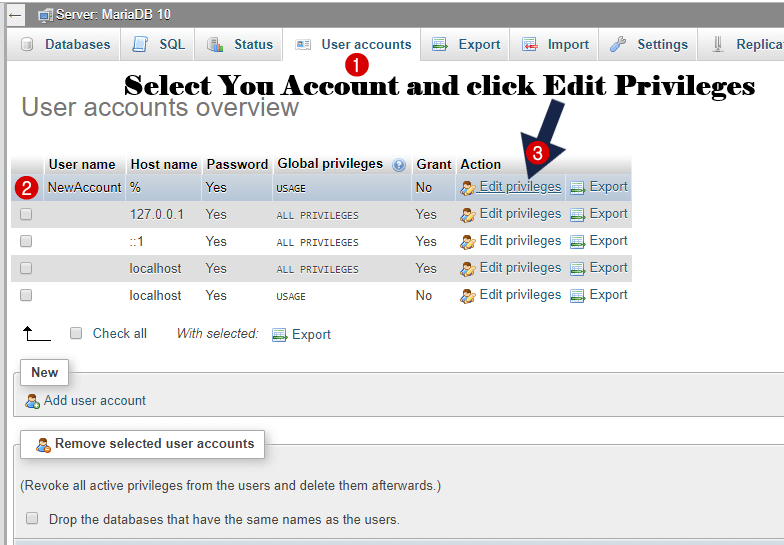

# Create New User
```mysql
CREATE USER 'dimaslanjaka'@'%' IDENTIFIED VIA mysql_native_password USING '***'; GRANT ALL PRIVILEGES
ON
    *.* TO 'dimaslanjaka'@'%' REQUIRE NONE WITH
GRANT OPTION MAX_QUERIES_PER_HOUR
    0 MAX_CONNECTIONS_PER_HOUR 0 MAX_UPDATES_PER_HOUR 0 MAX_USER_CONNECTIONS 0;
GRANT ALL PRIVILEGES
ON
    `dimaslanjaka\_%`.* TO 'dimaslanjaka'@'%';
```
> creating user with username `dimaslanjaka` with all previleges

# Change Password
```mysql
SET PASSWORD FOR
    dimaslanjaka@localhost = PASSWORD('dimaslanjaka');
GRANT ALL PRIVILEGES
ON
    *.* TO dimaslanjaka@localhost IDENTIFIED BY 'dimaslanjaka' WITH
GRANT OPTION
    ;
```

## Change Password From phpmyadmin
Select the user for which you want to change the password and click on **Edit privileges**.
