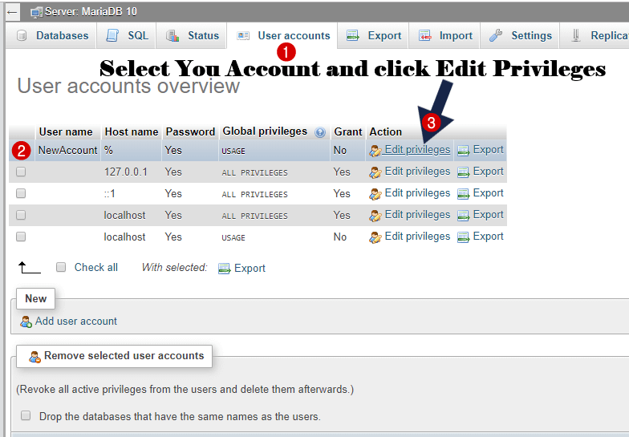

---
category:
  - Programming
  - MYSQL
cover: /2022/03/mysql-create-new-user/phpmyadmin-changepw.png
date: 2022-04-11T00:00:00+07:00
tags:
  - MySQL
title: MySQL Command to create new database user
updated: 2022-03-26T00:00:00+07:00
uuid: abcdca48-acd1-4888-8a33-cdcdb7b877dc
comments: true
wordcount: 186
description: MySQL Command to create new database user - Website Manajemen Indonesia
subtitle: MySQL Command to create new database user - Website Manajemen Indonesia
excerpt: MySQL Command to create new database user - Website Manajemen Indonesia
url: https://www.webmanajemen.com/2022/03/mysql-create-new-user.html
type: post
permalink: /2022/03/mysql-create-new-user.html
lang: en
thumbnail: /2022/03/mysql-create-new-user/phpmyadmin-changepw.png
photos:
  - /2022/03/mysql-create-new-user/phpmyadmin-changepw.png
---

First, you  need to open the database manager such as phpMyAdmin application to querying MySQL commands.
## Create New User
```mysql
CREATE USER 'dimaslanjaka'@'%' IDENTIFIED VIA mysql_native_password USING '***'; GRANT ALL PRIVILEGES
ON
    *.* TO 'dimaslanjaka'@'%' REQUIRE NONE WITH
GRANT OPTION MAX_QUERIES_PER_HOUR
    0 MAX_CONNECTIONS_PER_HOUR 0 MAX_UPDATES_PER_HOUR 0 MAX_USER_CONNECTIONS 0;
GRANT ALL PRIVILEGES
ON
    `dimaslanjaka\_%`.* TO 'dimaslanjaka'@'%';
```
> creating user with username `dimaslanjaka` with all previleges

## Change Password
In some cases, you may need or want to change your SQL database password. This guide  will walk you through how to change the SQL database password for a WordPress website hosted on a Synology NAS. Fortunately, Synology provides you with all the tools you need to do this.
```mysql
SET PASSWORD FOR
    dimaslanjaka@localhost = PASSWORD('dimaslanjaka');
GRANT ALL PRIVILEGES
ON
    *.* TO dimaslanjaka@localhost IDENTIFIED BY 'dimaslanjaka' WITH
GRANT OPTION
    ;
```

### Change Password From phpmyadmin
Select the user for which you want to change the password and click on **Edit privileges**.


## Flush privileges
```mysql
CREATE USER 'dimaslanjaka'@'%' IDENTIFIED VIA mysql_native_password USING '***'; GRANT ALL PRIVILEGES
ON
    *.* TO 'dimaslanjaka'@'%' REQUIRE NONE WITH
GRANT OPTION MAX_QUERIES_PER_HOUR
    0 MAX_CONNECTIONS_PER_HOUR 0 MAX_UPDATES_PER_HOUR 0 MAX_USER_CONNECTIONS 0;
GRANT ALL PRIVILEGES
ON
    `dimaslanjaka\_%`.* TO 'dimaslanjaka'@'%';
```